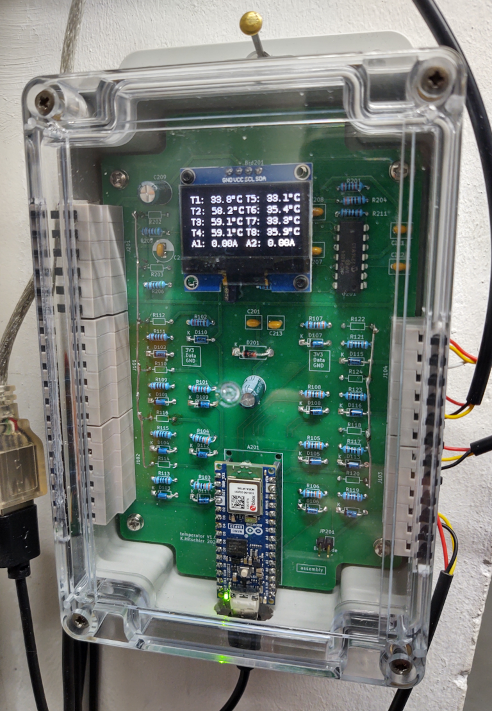
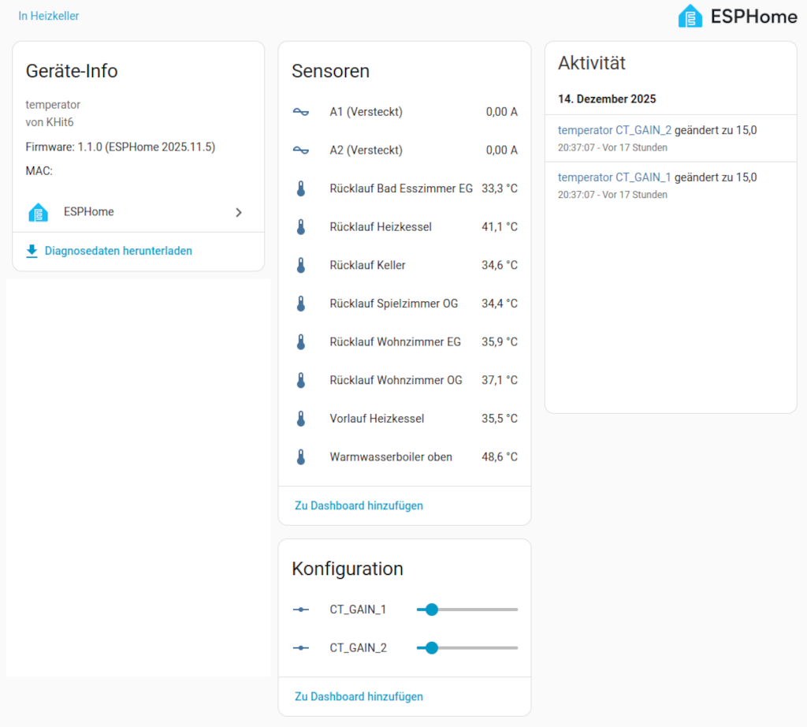

# temperator-esphome
## Smart connected device to measure 8 temperatures and 2 AC currents

This repository hosts the [ESPHome](https://esphome.io/) configuration for temperator. temperator is a robust and easy-to-use data acquisition system for taking 8 temperatures and 2 AC currents. Its design is simple yet professional and it is Open Source. The hardware design is hosted in [this repository](https://github.com/KHit6/temperator?tab=readme-ov-file).

ESPHome makes integration with [Home Assistant](https://www.home-assistant.io/) or other home automation systems very easy. Besides legacy Home Assistant connectivity, MQTT as interface protocol is also supported. temperator is open to integrate with most home automation and data acquisition systems.

It will be described how to set up the tool chain and how to compile the configuration **temperator.yaml** into a ready to use firmware. Actually ready means ready to load initial firmware into the hardware and ready for further over the air updates (OTA).

To accomplish this I installed the ESPHome tool chain as command line tools. There is an integration of ESPHome with Home Assistant, but I didn't use it. Mainly I tested with Linux, but a Windows installation of the tool chain works nearly similarly with the same results (Good job of the ESPHome makers.)

## Features
  * The configuration targets an [Arduino Nano ESP32](https://docs.arduino.cc/hardware/nano-esp32/) or compatible devices
  * It supports the acquisition of 8 individual connected DS18B20 temperature sensors and 2 AC currents through current transformers (CTs)
  * An on board I2C connected display shows actual measurement values
  * The (calculated) gain settings for the AC currents can be controlled from the connected host software, e.g. Home Assistant
  * Internal calibration removes the DC offset with analogue inputs automatically
  * As default the legacy Home Assistant connection protocol is used, but MQTT can be enabled as well
  * An on board LEDS clears when WiFi connection is established 

## Preparation
It makes little difference whether you use the following instructions with Linux or Windows. There are some minor differences, but these are due to the operating system environment and not due to ESPHome.

I assume you are using a shell; PowerShell with Windows or Bash with Linux.

 1. A current version of Git, Python, and [pipenv](https://pipenv.pypa.io/en/latest/) must be installed. Using pipenv is just one of many options, but it's very helpful. Although Python isn't used for any coding it is very helpful to install and manage the tool chain.
 1. Open your shell.
 1. Test if the paths work: "python --version" and "pipenv --version". Adjust the path settings if necessary.
 1. Clone from this repository and  change into this fresh created working directory
 1. If necessary, use a text editor to adjust the Python version listed in Pipfile to match the installed version.
 1. Run "pipenv install"; this will take a while…

## Usage
  1. Open your shell
  2. Navigate to the project folder, e.g., "cd temperator-esphome"
  3. Enter the virtual Python environment, "pipenv shell".
  4. Copy src/secrets-template.yaml to src/secrets.yaml
  4. Only the first times until compilation is successful do
  5. * Compile the project, "esphome compile src/temperator.yaml". The first time it will take a while. This step provides most of the surprises :-) .
  5. * If the test compilation was successful adjust at least your WIFI credentials and the OTA password in src/secrets.yaml. Other settings can be done later.
  6. Recompile to check for errors.
  7. Now, connect the temperator module or at least a target device (ESP32) to your PC via USB.
  8. Run "esphome run temperator.yaml". For the first time the individual firmware will be written to the temperator module. After compilation, you will be asked whether you want to load via serial interface or OTA. The first time, or after changing your login credentials, you must load the module via serial interface. Afterwards, OTA will do it.
  9. After loading, many logs will appear in the console. Sometimes this is useful. If it's bothersome, you can remove it by commenting out the section "logger" in src/temperator.yaml. Otherwise, you can always view the current log with "esphome logs temperator.yaml".
  10. The module's red or orange LED will blink until a connection to the server is established. It clears when a connection is established.
  11. Congratulations, the module is now transmitting its information. Please inspect the display if the measurement values are reasonable. 

## some impressions

## Some hints
### Build listing
An example first time build listing is documented [here](docs/build-listing.txt).

### Different ways to your data
If you uncomment the "mqtt" section in src/temperator.yaml file, then MQTT messages are being sent. If the "api" section is not commented out, then the module is also sending to a local Home Assistant instance. If the "web-server:" section isn't uncommented, then the module is also making its information available via a simple web server. In every case please consider appropriate value within secrets.yaml.

### MQTT Topics
MQTT topics start with "temperator" followed for example by "/sensor/t4/state" for sensor values. "t4" here is the short name for the t4 temperature channel.
Furthermore there is "/number/ct_gain_1/command" topic. This example sets the gain for the first current sensor. The default is 15 amps/volt.

